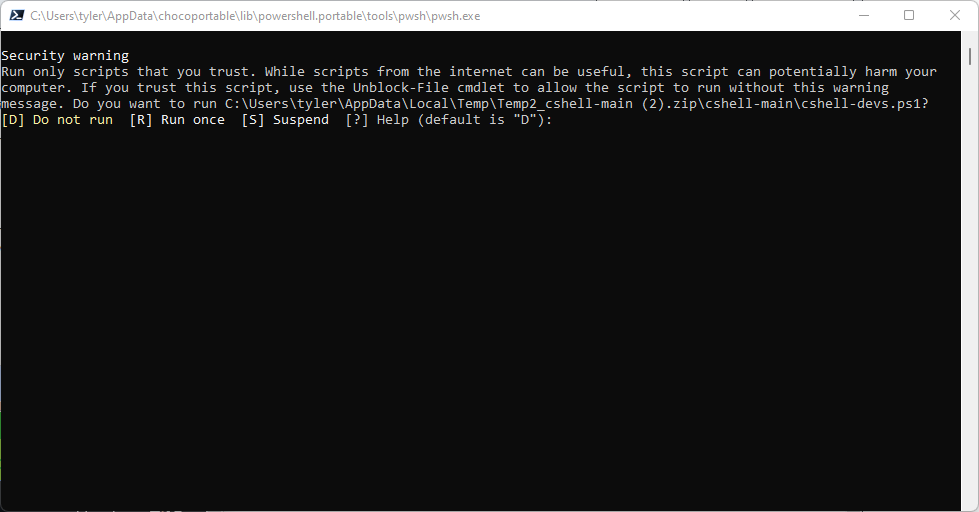

# cshell
A free, technical PowerShell game engine.
## Setup
*Note: Windows only. For other operating systems get the ZIP.*

If you've got chocolatey, run `choco install powershell.portable`. `choco install powershell` does not work since only the portable version is hosted on the chocolatey community.

Here's a demo:
```pwsh
$ErrorActionPreference = 'Stop'; # stop on all errors
$toolsDir = "$(Split-Path -parent $MyInvocation.MyCommand.Definition)"

$PSVersion = '7.1.3'

$packageArgs = @{
    packageName    = 'powershell.portable'
    # 32-bit
    url            = "https://github.com/PowerShell/PowerShell/releases/download/v$PSVersion/PowerShell-$PSVersion-win-x86.zip"
    checksum       = 'ECFD51545084D9B791874062C39EB0C7C7DD2991265EE7F4DC5064995A614E6C'
    checksumType   = 'sha256'
    # 64-bit
    url64bit       = "https://github.com/PowerShell/PowerShell/releases/download/v$PSVersion/PowerShell-$PSVersion-win-x64.zip"
    checksum64     = '47475F1D4015704F3FB5F6D2CF61196D121ABA60C19592B04BE818317CE01039'
    checksumType64 = $checksumType
    # misc
    unziplocation  = "$toolsDir\pwsh"
}

Install-ChocolateyZipPackage @packageArgs
```
If you do not have chocolatey, see the instructions at https://chocolatey.org/install. If you would like to use a commercial Choco to install PowerShell, you must install a licensed version (mostly pro).

Now, download the ZIP for CShell.
Most people may find a prompt asking for confirmation:


So, type `r` and press Enter, or extract the ZIP, cd the newly extacted folder's `cshell-main` subfolder and run `Unblock-File .cshell-devs.ps1`.

Read the license. If you agree to it, press Enter.

Follow the on-screen instructions then you are ready to go! :)
